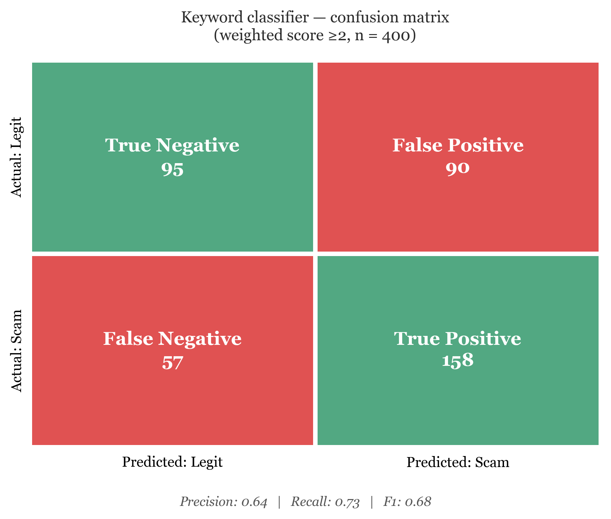

# FinTokFraud — TikTok Scam Detection

An interpretable **NLP-based scam detection system** that analyzes linguistic patterns in TikTok content to distinguish potential scams from legitimate posts.

The project analyzes **400 manually labeled TikTok posts** across **financial, health, and lifestyle** content using captions, hashtags, and top comments.

## 🔍 What We Built

We developed a **weighted keyword classifier** that identifies linguistic signals commonly associated with scam content, including:

- Recruitment language
- Supplement and health deception
- Vague earnings claims
- Scarcity and urgency
- Credibility and proof claims
- Risk-hiding language

Each detected signal contributes to a weighted scam score. We tested multiple classification thresholds to study the tradeoff between catching more scams and incorrectly flagging legitimate content.

We also implemented a **TF-IDF + Logistic Regression** model as a machine-learning baseline for comparison.

## 📊 Results

| Metric | Result |
|---|---:|
| Precision | **0.64** |
| Recall | **0.73** |
| F1 Score | **0.68** |
| Cohen's Kappa | **0.86** |

The classifier detected approximately **73% of scam posts** at the selected threshold.

## 💡 Key Findings

- **Supplement deception** and **recruitment language** were among the strongest indicators of scam content.
- Many scam and legitimate posts use similar marketing language, making text-only detection challenging.
- High inter-rater agreement (**κ = 0.86**) supported the reliability of the manual labels.
- Changing the classification threshold produced a clear **precision-recall tradeoff**.
- Textual signals are useful, but stronger moderation systems would also benefit from visual, behavioral, profile, and link-based signals.

## 🧪 Methodology

**1. Data Collection**  
Collected 400 TikTok posts across financial, health, and lifestyle categories.

**2. Manual Labeling**  
Posts were manually classified as scam or legitimate. A subset was independently reviewed by a second annotator to measure agreement.

**3. Text Processing**  
Captions, hashtags, and top comments were combined into a single text representation.

**4. Classification**  
Posts were scored using a weighted lexicon of scam-related linguistic patterns.

**5. Evaluation**  
Performance was evaluated using precision, recall, F1 score, confusion matrices, threshold testing, error analysis, and Cohen's Kappa.

## 🛠️ Technologies

`Python` `pandas` `scikit-learn` `TF-IDF` `Logistic Regression` `NLP` `matplotlib` `seaborn`

## ⚠️ Limitations

Scammers frequently reuse ordinary marketing language, meaning linguistic patterns alone cannot reliably capture every scam.

Future work could incorporate **images, video, audio, account behavior, external links, and larger datasets** to develop a multimodal detection system.

## 📄 Project Presentation

[View the FinTokFraud presentation](docs/FinTokFraud-Presentation.pdf)

## 👥 Author
Mariam Rukhaia 
NYU Tandon School of Engineering
